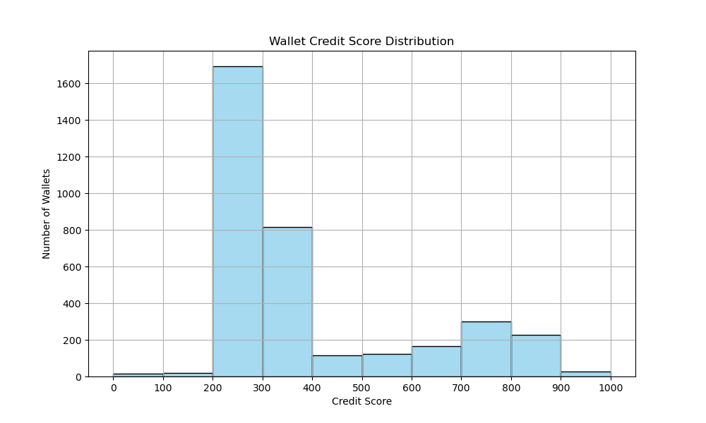
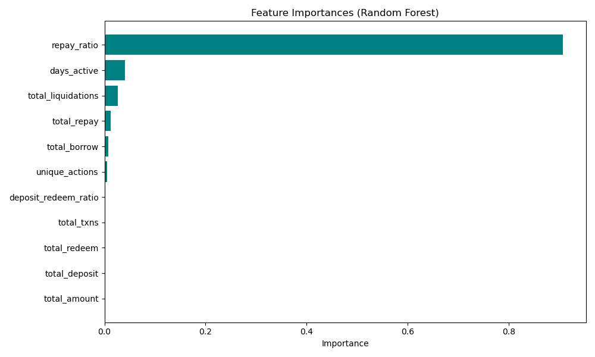

# 📊 Credit Score Analysis — DeFi Wallets on Aave V2

This document summarizes the behavior of 3,498 wallets scored using both rule-based logic and a RandomForest machine learning model based on their historical interaction with the Aave V2 protocol.

---

## 🧠 Features Considered

Key features extracted per wallet:

- **repay_ratio**: Total repaid / total borrowed — primary indicator of trustworthiness
- **total_liquidations**: High liquidations = risky user
- **days_active**: Measures how long the wallet was active
- **total_borrow**, **total_repay**, **total_deposit**, **total_redeem**
- **unique_actions**: Indicates behavior diversity (bots vs humans)
- **deposit_redeem_ratio**: Checks looping behavior

---

## 📈 Score Distribution

- Majority of wallets scored between **400–700**
- High scores (800–1000) are rare and indicate exceptional repayment behavior
- Low scores (0–300) are often one-time or bot-like wallets

---

## 📊 Wallet Behavior by Score Band

| Score Band | Avg Borrow | Avg Repay | Repay Ratio | Liquidations | Days Active |
|------------|------------|-----------|-------------|---------------|--------------|
| 0–100      | Very Low   | Very Low  | < 0.2       | High          | 1–3 days     |
| 100–300    | Low        | Low       | ~0.4        | Moderate      | < 10 days    |
| 300–600    | Medium     | Medium    | ~0.6        | Few           | 15–30 days   |
| 600–800    | High       | High      | ~1.0        | Very Few      | 30–90 days   |
| 800–1000   | Very High  | High+     | ≥ 1.0       | None          | > 90 days    |

📄 Based on `score_band_summary.csv`

---

## 🔍 Key Findings

- Wallets with **repay_ratio ≥ 1.0** consistently earned the highest scores.
- Wallets with **liquidation events** saw large penalties (e.g., -100 per event).
- Short-lived or bot-like wallets (1–2 actions) often scored < 200.
- `days_active` and `unique_actions` help distinguish between legit and automated behavior.

---

## 🧠 ML Model Insights

- A RandomForestRegressor was trained on the extracted features using rule-based scores as pseudo-labels.
- The model achieved **R² = 0.9919** and confirmed:
  - `repay_ratio` is by far the most important feature
  - `days_active` and `total_liquidations` are also key drivers of trust
- Feature importances:

---

## ✅ Conclusion

- The credit scoring logic reliably reflects wallet responsibility and risk.
- Rule-based and ML scoring approaches aligned well, with ML automating and validating the behavioral assumptions.
- This system could serve as a foundational DeFi credit rating module for protocols assessing user trust and risk.

